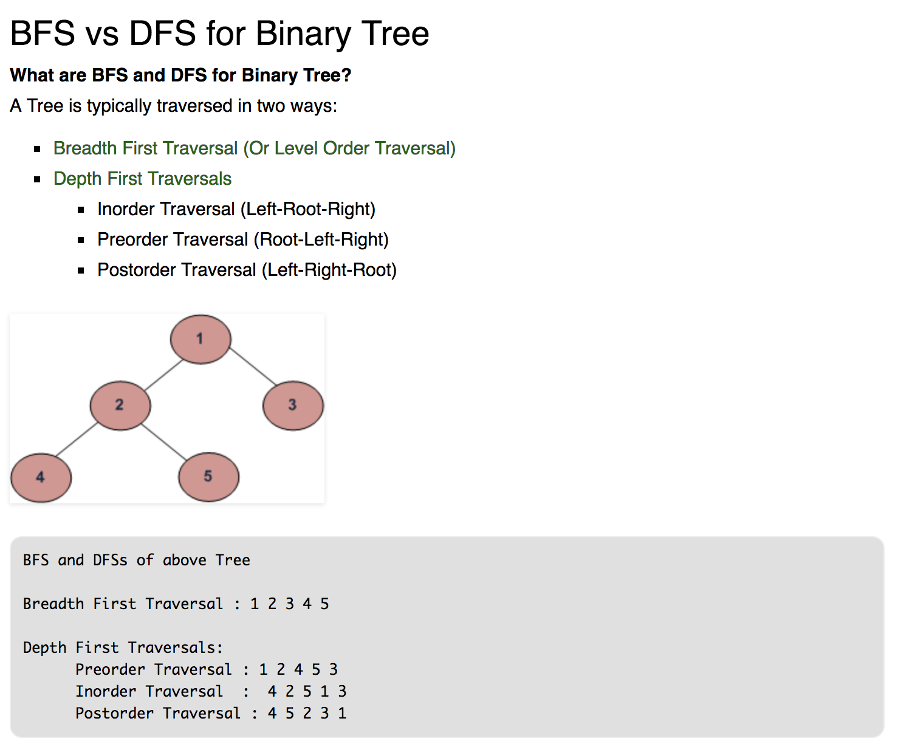

# leetcode-python
practice and share the leetcode I solved

Try to solve leetcode questions with simple way.

## 1. Two Sum
Given an array of integers, return indices of the two numbers such that they add up to a specific target.

You may assume that each input would have exactly one solution, and you may not use the same element twice.

Example:
```
Given nums = [2, 7, 11, 15], target = 9,

Because nums[0] + nums[1] = 2 + 7 = 9,
return [0, 1].
```
### solution
```python
class Solution:
    def twoSum(self, nums, target):
        """
        :type nums: List[int]
        :type target: int
        :rtype: List[int]
        """
        cmp = nums.copy()
        for i in nums:
            cmp.pop(0)
            test = [i+j for j in cmp]
            if target in test:
                index0 = nums.index(i)
                index1 = test.index(target) + index0 +1
                return [index0, index1]
                
```
---

## 26. Remove Duplicates from Sorted Array
Given a sorted array nums, remove the duplicates in-place such that each element appear only once and return the new length.

Do not allocate extra space for another array, you must do this by modifying the input array in-place with O(1) extra memory.

Example 1:
```
Given nums = [1,1,2],

Your function should return length = 2, with the first two elements of nums being 1 and 2 respectively.

It doesn't matter what you leave beyond the returned length.
```
Example 2:
```
Given nums = [0,0,1,1,1,2,2,3,3,4],

Your function should return length = 5, with the first five elements of nums being modified to 0, 1, 2, 3, and 4 respectively.

It doesn't matter what values are set beyond the returned length.
```

### solution
```python
class Solution:
    def removeDuplicates(self, nums):
        """
        :type nums: List[int]
        :rtype: int
        """
        if len(nums) < 2:
            return len(nums)
        i = 0
        for j in nums[i+1:]:
            if nums[i] != j:
                nums[i+1] = j
                i += 1
        return i+1
```

---

## 771. Jewels and Stones
You're given strings J representing the types of stones that are jewels, and S representing the stones you have.  Each character in S is a type of stone you have.  You want to know how many of the stones you have are also jewels.

The letters in J are guaranteed distinct, and all characters in J and S are letters. Letters are case sensitive, so "a" is considered a different type of stone from "A".

Example 1:
```
Input: J = "aA", S = "aAAbbbb"
Output: 3
```
Example 2:
```
Input: J = "z", S = "ZZ"
Output: 0
```
Note:

S and J will consist of letters and have length at most 50.
The characters in J are distinct.

### solution
```python
class Solution:
    def numJewelsInStones(self, J, S):
        """
        :type J: str
        :type S: str
        :rtype: int
        """
        money = 0
        for i in S:
            if i in J:
                money +=1
        return money
```
---
## 665. Non-decreasing Array
Given an array with n integers, your task is to check if it could become non-decreasing by modifying at most 1 element.

We define an array is non-decreasing if array[i] <= array[i + 1] holds for every i (1 <= i < n).

Example 1:
```
Input: [4,2,3]
Output: True
Explanation: You could modify the first 4 to 1 to get a non-decreasing array.
```
Example 2:
```
Input: [4,2,1]
Output: False
Explanation: You can't get a non-decreasing array by modify at most one element.
```
Note: The n belongs to [1, 10,000].

### solution
```python
class Solution:
    def checkPossibility(self, nums):
        """
        :type nums: List[int]
        :rtype: bool
        """
        # non-decreasing means increasing or equal
        if len(nums) <= 2 :
            return True
        error = 0
        for i in range(len(nums)-1):
            if nums[i] > nums[i+1]:
                error += 1
                if i == 0:
                    nums[0] = nums[1]
                elif ((i != len(nums)-2) and (nums[i-1] <= nums[i+1])):
                    nums[i] > nums[i-1]
                else:
                    nums[i+1] = nums[i]  
        if error > 1:
            return False
        else:
            return True
```
---

## 155. Min Stack
Design a stack that supports push, pop, top, and retrieving the minimum element in constant time.

push(x) -- Push element x onto stack.
pop() -- Removes the element on top of the stack.
top() -- Get the top element.
getMin() -- Retrieve the minimum element in the stack.
Example:
```
MinStack minStack = new MinStack();
minStack.push(-2);
minStack.push(0);
minStack.push(-3);
minStack.getMin();   --> Returns -3.
minStack.pop();
minStack.top();      --> Returns 0.
minStack.getMin();   --> Returns -2.
```
### solution
```python
class MinStack:

    def __init__(self):
        """
        initialize your data structure here.
        """
        self.Q = []

    def push(self, x):
        """
        :type x: int
        :rtype: void
        """
        self.Q.append(x)

    def pop(self):
        """
        :rtype: void
        """
        if len(self.Q) == 0:
            return None
        else:
            return self.Q.pop(len(self.Q)-1)

    def top(self):
        """
        :rtype: int
        """
        if len(self.Q) == 0:
            return None
        else :
            return self.Q[(len(self.Q)-1)]        

    def getMin(self):
        """
        :rtype: int
        """
        if len(self.Q) == 0:
            return None
        else :
            return min(self.Q)          


# Your MinStack object will be instantiated and called as such:
# obj = MinStack()
# obj.push(x)
# obj.pop()
# param_3 = obj.top()
# param_4 = obj.getMin()
```
---

## 160. Intersection of Two Linked Lists
Write a program to find the node at which the intersection of two singly linked lists begins.


For example, the following two linked lists:
```
A:          a1 → a2
                   ↘
                     c1 → c2 → c3
                   ↗            
B:     b1 → b2 → b3
begin to intersect at node c1.
```
Notes:

If the two linked lists have no intersection at all, return null.
The linked lists must retain their original structure after the function returns.
You may assume there are no cycles anywhere in the entire linked structure.
Your code should preferably run in O(n) time and use only O(1) memory.
### solution
```python
# Definition for singly-linked list.
# class ListNode(object):
#     def __init__(self, x):
#         self.val = x
#         self.next = None

"""
They must have same nodes after the intersection point.
L1+L2 must have same tail from the intersection point as L2 + L1, so that we can move each time
"""
class Solution(object):
    def getIntersectionNode(self, headA, headB):
        """
        :type head1, head1: ListNode
        :rtype: ListNode
        """
        pA, pB = headA, headB
        if (pA == None) or (pB == None):
            return None
        while pA and pB:
            if pA == pB:
                return pA
            pA = pA.next
            pB = pB.next
            if (pA == None) and (pB == None):
                return None
            elif pA == None:        # if pA is end, connect to headB once 
                    pA = headB
            elif pB == None:        # if pB is end, connect to headA once
                    pB = headA
        return None
```
---

## 102. Binary Tree Level Order Traversal
Given a binary tree, return the level order traversal of its nodes' values. (ie, from left to right, level by level).

For example:
```
Given binary tree [3,9,20,null,null,15,7],
    3
   / \
  9  20
    /  \
   15   7
```
return its level order traversal as:
```
[
  [3],
  [9,20],
  [15,7]
]
```
### hint
```
hint: should add if node.left
>>> b
[2, 3, 4]
>>> b.append(None)
>>> b
[2, 3, 4, None]

hint: unable to use list(root)
>>> a 
'i am king of the world'
>>> list(a)
['i', ' ', 'a', 'm', ' ', 'k', 'i', 'n', 'g', ' ', 'o', 'f', ' ', 't', 'h', 'e', ' ', 'w', 'o', 'r', 'l', 'd']
>>> [a]
['i am king of the world']
```


### solution - BFS
```python
# Definition for a binary tree node.
# class TreeNode:
#     def __init__(self, x):
#         self.val = x
#         self.left = None
#         self.right = None

class Solution:
    def levelOrder(self, root):
        """
        :type root: TreeNode
        :rtype: List[List[int]]
        """
        res = []
        if root == None:
            return res
        q = [root]
        while len(q) != 0:
            # res.append([node.val for node in q])
            tmp_res = []
            tmp_q = []
            for node in q:
                tmp_res.append(node.val)
                if node.left:
                    tmp_q.append(node.left)
                if node.right:
                    tmp_q.append(node.right)
            res.append(tmp_res)
            q = tmp_q
        return res
```

### solution - DFS
```python
# Definition for a binary tree node.
# class TreeNode:
#     def __init__(self, x):
#         self.val = x
#         self.left = None
#         self.right = None

class Solution:
    def levelOrder(self, root):
        """
        :type root: TreeNode
        :rtype: List[List[int]]
        """
        res = []
        depth = 0
        self.dfs(root, depth, res)
        return res
    def dfs(self, tmp_root, tmp_depth, tmp_res):
        if tmp_root == None:
            return tmp_res
        if len(tmp_res) < tmp_depth + 1:
            tmp_res.append([])
        tmp_res[tmp_depth].append(tmp_root.val)
        self.dfs(tmp_root.left, tmp_depth+1, tmp_res)
        self.dfs(tmp_root.right, tmp_depth+1, tmp_res)
```
---

## 199. Binary Tree Right Side View
Given a binary tree, imagine yourself standing on the right side of it, return the values of the nodes you can see ordered from top to bottom.

Example:
```
Input: [1,2,3,null,5,null,4]
Output: [1, 3, 4]
Explanation:

   1            <---
 /   \
2     3         <---
 \     \
  5     4       <---
```

### solution - BFS
```python
# Definition for a binary tree node.
# class TreeNode:
#     def __init__(self, x):
#         self.val = x
#         self.left = None
#         self.right = None

class Solution:
    def rightSideView(self, root):
        """
        :type root: TreeNode
        :rtype: List[int]
        """
        res = []
        if root == None:
            return res
        q = [root]
        while len(q) != 0:
            res.append(q[len(q)-1].val)
            tmp_q = []
            for node in q:
                if node.left:
                    tmp_q.append(node.left)
                if node.right:
                    tmp_q.append(node.right)
            q = tmp_q
        return res
```
---

## 20. Valid Parentheses
Given a string containing just the characters '(', ')', '{', '}', '[' and ']', determine if the input string is valid.

An input string is valid if:

Open brackets must be closed by the same type of brackets.
Open brackets must be closed in the correct order.
Note that an empty string is also considered valid.

Example 1:
```
Input: "()"
Output: true
```
Example 2:
```
Input: "()[]{}"
Output: true
```
Example 3:
```
Input: "(]"
Output: false
```
Example 4:
```
Input: "([)]"
Output: false
```
Example 5:
```
Input: "{[]}"
Output: true
```

### solution
```python
class Solution:
    def isValid(self, s):
        """
        :type s: str
        :rtype: bool
        """
        # use stack to solve the problem 
        # if when the left side ends, the first right side must be pair with the last left side

        # must be pair
        l_s = len(s)
        if l_s == 0:
            return True
        elif l_s % 2 != 0:
            return False
        
        stack = [] # make stack
        v_dic = {  ")":"(",   "]":"[",   "}":"{"  } # mapping
        
        if s[0] not in v_dic.values():
            return False
        
        for char in s: 
            if char in v_dic.values():
                stack.append(char)
            elif char in v_dic.keys():
                if v_dic[char] != stack.pop():
                    return False
            else: 
                return False
        if stack == []:
            return True
        else:
            return False
```
---

## 200. Number of Islands
Given a 2d grid map of '1's (land) and '0's (water), count the number of islands. An island is surrounded by water and is formed by connecting adjacent lands horizontally or vertically. You may assume all four edges of the grid are all surrounded by water.

Example 1:
```
Input:
11110
11010
11000
00000

Output: 1
```
Example 2:
```
Input:
11000
11000
00100
00011

Output: 3
```
### solution
```python
class Solution:
    def numIslands(self, grid):
        """
        :type grid: List[List[str]]
        :rtype: int
        """
        """
        Use DFS, once it touch 1s, continue to search near part form up/down/left/right
        count of island + 1
        And then change the sysbol to anaother for avoiding next search
        """
        count = 0
        if not grid:
            return 0
        range_x = range(len(grid))     # range for x axis
        range_y = range(len(grid[0]))        # range for y axis
        #print("{},{}".format(range_x, range_y))
        for x in range_x:
            for y in range_y:
                if grid[x][y] == '1':
                    count += 1          # find an island
                    self.dfs(grid, x, y)
        return count
    
    def dfs(self, tmp_grid, tmp_x, tmp_y):
        print("{},{}".format(tmp_x, tmp_y))
        if tmp_x < 0 or tmp_x >= len(tmp_grid) or tmp_y < 0 or tmp_y >= len(tmp_grid[0]) :
            return
        if tmp_grid[tmp_x][tmp_y] != '1':
            return
        tmp_grid[tmp_x][tmp_y] = "E"            # change to anather symbol
        self.dfs(tmp_grid, tmp_x - 1, tmp_y)    # change neighborhood -x direction
        self.dfs(tmp_grid, tmp_x + 1, tmp_y)    # change neighborhood x direction
        self.dfs(tmp_grid, tmp_x, tmp_y - 1)    # change neighborhood -y direction
        self.dfs(tmp_grid, tmp_x, tmp_y + 1)    # change neighborhood y direction
 ```
 ---

## 204. Count Primes
Count the number of prime numbers less than a non-negative number, n.

Example:
```
Input: 10
Output: 4
Explanation: There are 4 prime numbers less than 10, they are 2, 3, 5, 7.
```
### solution
```python
class Solution:
    def countPrimes(self, n):
        """
        :type n: int
        :rtype: int
        """
        """
        import math as math0
        
        if n <= 2:          # no prime numbers less than 2
            return 0
        count = 1           # if n >= 3, at least has one prime number 2
        nums = [1]*n        # list form index 0 to index n-1
        nums[0], nums[1] = 0,0  # 0 and 1 is not prime number
        """
        if n <= 2:
            return 0
        res = [True] * n
        res[0] = res[1] = False
        for i in range(2, n):
            if res[i] == True:
                for j in range(2, (n-1)//i+1):
                    res[i*j] = False
        return sum(res)


```
---


